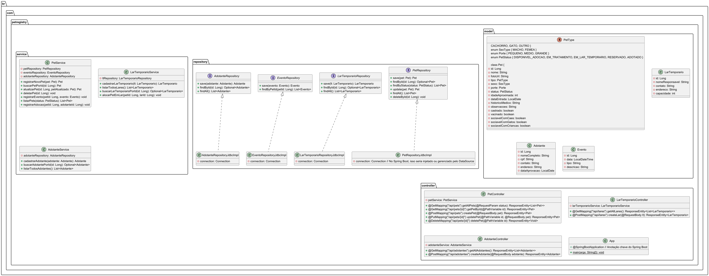
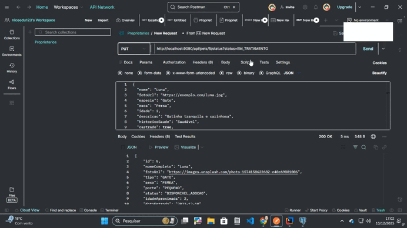
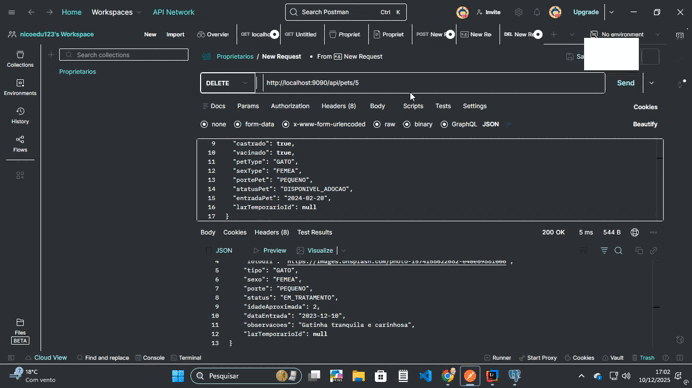

## 📊 Modelo de Dados

## 🎥 Demonstrações

### Interface Web (Browser)

**Cadastro de Pet** – fluxo completo de registro pelo formulário web.

**Edição de Pet** – atualização dos dados direto pela interface.

**Exclusão de Pet** – remoção segura com feedback visual.

**Fluxo Completo de Adoção** – sequência do cadastro até a conclusão da adoção.

---

### API REST (Postman)

**Inserir Pet** – request POST enviando o payload completo.

**Listar Todos os Pets** – visão geral dos registros salvos.

**Listar Pet por ID** – busca pontual validando os filtros.

**Atualizar Pet** – envio do PUT com apenas os campos modificados.

**Deletar Pet** – exclusão confirmada no endpoint DELETE.

⭐ Desenvolvido com dedicação para facilitar o trabalho de ONGs e instituições de proteção animal.
